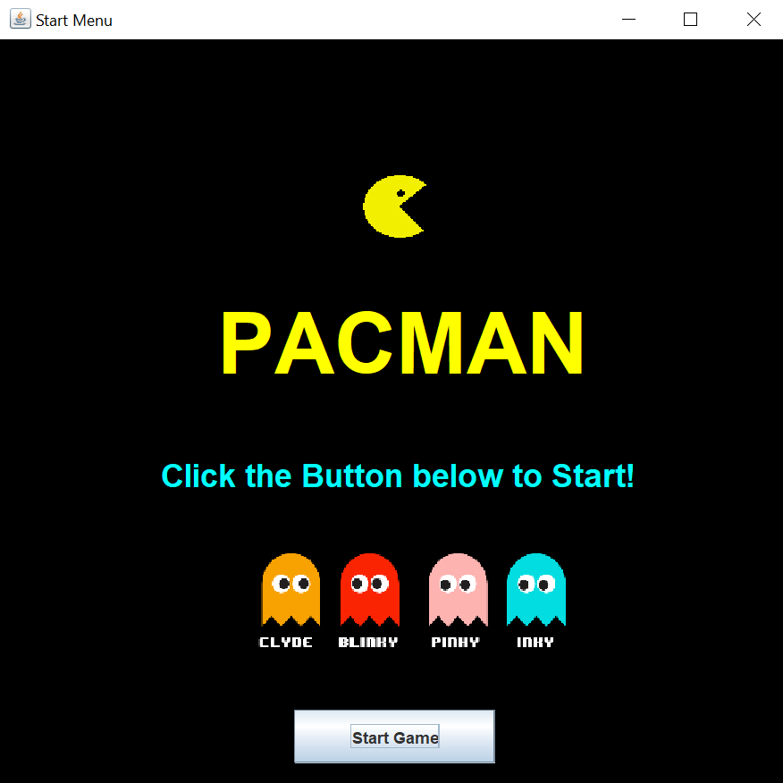
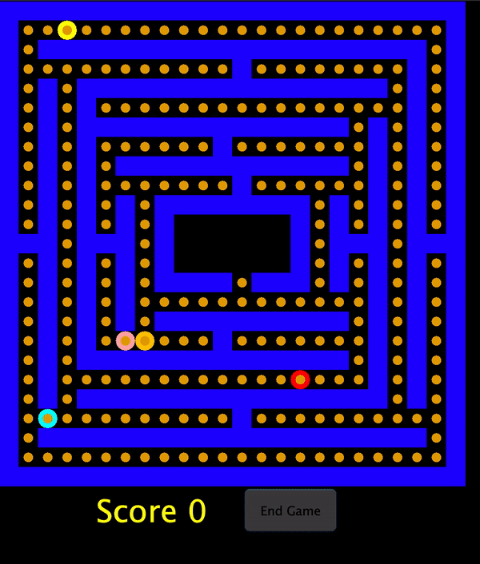

# Project 3 - Pacman 

### Team 7 Members
- Ivana Sanchez Diaz
- Asfandyar Khan
- Yoel Popovici
- Josue Proano 

## Pacman Class

### get_valid_moves()
#### Method Description
Using Pacman's current location, this function checks if Pacman can move 1 step up,down,left,right and adds those directions to a list.  If a wall is located in one of those directions the location is not added to the list.
#### Test Description
Placing Pacman at location (9,11) the valid locations should be (9,12) (10,11) and we check that those moves are inside the list returned by the method. 

### move()
#### Method Description
Using Pacman's get_valid_moves() method, this method moves pacman to the first location (valid move) that is either empty or contains a cookie and returns true. If such a location is not found, it returns false. 
#### Test Description
This test first adds a Pacman to Location (1, 0), and then moves Pacman with move() method. It then checks to make sure that the Pacman is not at Location (1, 0) anymore.

### is_ghost_in_range()
#### Method Description
Inside the components of Pacman, we want to locate if there are any ghosts +1 coordinate point around him. If the ghost is 1+ coordinate point away, then the ghost can attack pacman and return the true. If the ghost is not +1 coordinate point away from him, then pacman cannot be attacked because the ghost is not close enough so we return false. There are also checks for Null data.
#### Test Description
The first test checks that the ghost should be close to Pacman, so it should return true. I put (9,11) for the ghost coordinate and (9,12) for the Pacman coordinate. The second test should return false, because for that I just changed the ghost coordinate to (9,8), so the ghost would not be close enough.

---

## Ghost Class
### get_valid_moves()
#### Method Description
Using Ghost's current location, this function checks if Pacman can move 1 step up,down,left,right and adds those directions to a list.  If a wall is located in one of those directions the location is not added to the list.
#### Test Description
Placing Ghost at location (9,11) the valid locations should be (9,12) (10,11) and we check that those moves are inside the list returned by the method. We also check for location (10,12) which returns false. 

### move()
#### Method Description
Using Ghost's get_valid_moves() method, this method moves the ghost to the first location (valid move) that does not contain a wall. If such a location is not found, it returns false. 
#### Test Description
This test first adds a Ghost to Location (1, 0), and then uses the move() method to it. It then checks to make sure that the Ghost is not at Location (1, 0) anymore.

### is_pacman_in_range()
#### Method Description
Inside the components of Ghost, we want to locate if Pacman is +1 coordinate point around the current ghost. If Pacman is 1+ coordinate point away, then the current ghost can attack that Pacman and return the true. If Pacman is not +1 coordinate point away from the ghost, then the ghost cannot be attacked because pacman is not close enough so we return false. There is also checks for Null data.
#### Test Description 
The first test checks that the Pacman should be close to ghost, so it should return true. I put (9,11) for the ghost coordinate and (9,12) for the Pacman coordinate. The second test should return false, because for that I just changed the ghost coordinate to (9,8), so the ghost would not be close enough.

---

## Map Class 
### move(String name, Location loc, Type type)
#### Method Description
Using the name, loc, and type this method will update Pacman or Ghost types locations in the field, locations, and components.  This method also checks that the location parameter is within the map bounds.  Also checking that type is of type PACMAN or GHOST.  
#### Test Description
Testing two valid locations (1,2) (1,1) where Pacman can be placed, (0,0) which is a wall returning false, and (23,15) which is out of bounds.

### getLoc(Location loc)
#### Method Description
Using the parameter loc, the method returns a HashSet of one of following types, (EMPTY, PACMAN, GHOST, WALL, COOKIE), depending on what is currently at that location.
#### Test Description
There are two tests for this method. They both first add a pacman to Location (1, 0). The first one checks to make sure that the type at Location (1, 0) matches the one returned by the getLoc method. The second one checks to make sure that the type returned by the getLoc method at Location (2, 0) does not contain a Pacman.

### attack(String name)
#### Method Description
This method checks if a ghost was actually able to eat pacman. If it did happen you return true and change the gameOver boolean to true as well. If it did not happen, you return false.
#### Test Description 
This method is very similar to the is_ghost_in_range and is_pacman_in_range. I took the example that was given and changed the name of the ghost to Clyde. Clyde is in range of pacman with coordinates (9,11). I made the case where he does eat pacman and it returns true since Pacman is in (9,12). The other test will return false and the game resumes since Clyde is in coordinate (9,8) and Pacman is still in (9,12).

---

## Extra Info 
### Map 
Helps visualize how the tests are run based on coordinates. 

